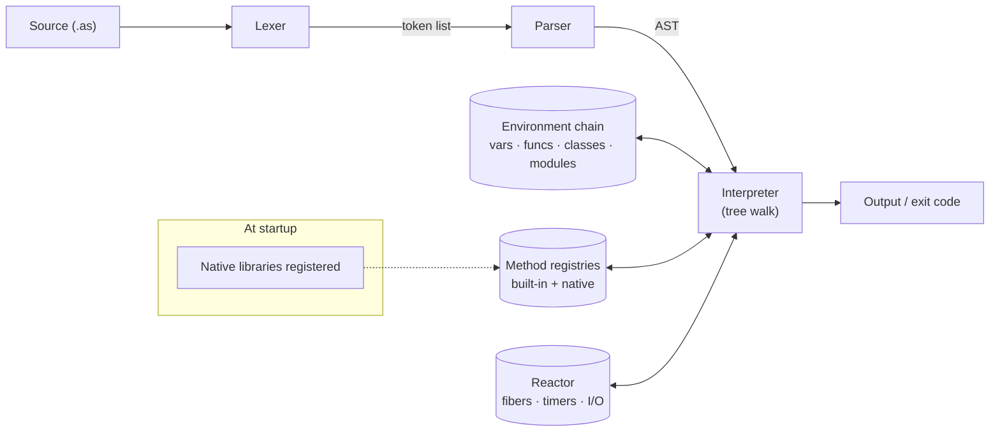
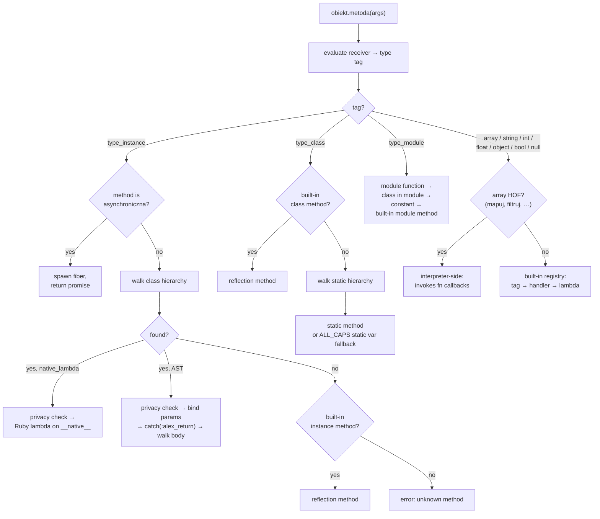
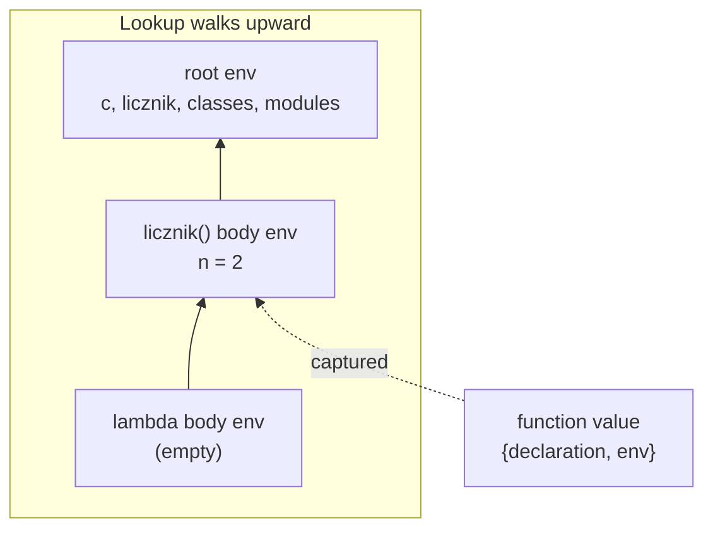
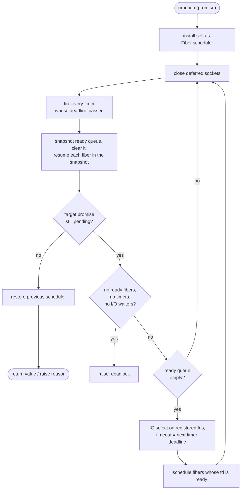

# AlexScript — Architecture

*Document version: 30 August 2026. Describes AlexScript 0.10.27, running on Ruby 4.0.6.*

---

## Contents

- [Why this language exists](#why-this-language-exists)
- [1. Overview](#1-overview)
  - [What the language looks like](#what-the-language-looks-like) · [The value representation](#the-value-representation) · [Design decisions](#design-decisions) · [The dispatch loop](#the-dispatch-loop)
- [2. Lexer](#2-lexer)
  - [Bytes, not characters](#bytes-not-characters) · [Polish letters in identifiers](#polish-letters-in-identifiers) · [Keywords, hard and soft](#keywords-hard-and-soft) · [Numeric literals](#numeric-literals) · [Strings and interpolation](#strings-and-interpolation)
- [3. Parser](#3-parser)
  - [Precedence](#precedence) · [The one node for arrays and objects](#the-one-node-for-arrays-and-objects) · [Postfix chains, and where they stop](#postfix-chains-and-where-they-stop) · [Runtime resolution of parser guesses](#runtime-resolution-of-parser-guesses) · [What the parser does eagerly](#what-the-parser-does-eagerly) · [Static validation](#static-validation) · [Multiple assignment](#multiple-assignment)
- [4. Object model](#4-object-model)
  - [Classes are objects, not names](#classes-are-objects-not-names) · [Redeclaring a class](#redeclaring-a-class) · [Inheritance and lookup](#inheritance-and-lookup) · [super](#super) · [Private and static members](#private-and-static-members) · [Modules](#modules) · [The unified method registry](#the-unified-method-registry) · [Where dispatch branches](#where-dispatch-branches)
- [5. Environments and closures](#5-environments-and-closures)
  - [Declaration versus assignment](#declaration-versus-assignment) · [Closures](#closures) · [Instance context](#instance-context) · [Argument passing](#argument-passing) · [Recursion depth](#recursion-depth)
- [6. Exceptions](#6-exceptions)
  - [Exception classes are classes](#exception-classes-are-classes) · [Throwing](#throwing) · [Catching](#catching) · [The catch variable](#the-catch-variable) · [Ruby errors coming the other way](#ruby-errors-coming-the-other-way) · [Return, break, continue](#return-break-continue)
- [7. Async runtime](#7-async-runtime)
  - [Calling an async function](#calling-an-async-function) · [Promises](#promises) · [The three built-ins](#the-three-built-ins) · [The reactor loop](#the-reactor-loop) · [What is actually non-blocking](#what-is-actually-non-blocking)
- [8. Native libraries](#8-native-libraries)
  - [Registering a class](#registering-a-class) · [Types across the boundary](#types-across-the-boundary) · [Loading](#loading) · [The standard library](#the-standard-library)
- [9. Tooling](#9-tooling)
  - [REPL](#repl) · [Debugger](#debugger) · [Errors and stack traces](#errors-and-stack-traces)
- [10. Performance](#10-performance)
- [11. Known limitations](#11-known-limitations)
  - [Architectural ceilings](#architectural-ceilings) · [Language gaps](#language-gaps) · [Known defects](#known-defects) · [Async limitations](#async-limitations)

---

## Why this language exists

Polish speakers who program do it in English. That is not a complaint about English — it is a description of a small, permanent tax that everyone outside the anglophone world pays and nobody ever gets refunded. The interesting question is whether the tax is unavoidable. It mostly is, for the ecosystem: libraries, error messages, Stack Overflow. But the language itself does not have to be in English, and for someone learning to program the difference between `if` and `jesli` is not cosmetic.

There have been Polish-language languages before. SAKO — *System Automatycznego Kodowania* — was built at the Polish Academy of Sciences between 1959 and 1960, and it really did have Polish commands: `CZYTAJ`, `SKOCZ DO`. It ran on the ZAM machines, it was aimed at numerical work, and it is now sixty-five years old. LOGLAN-82, from the University of Warsaw, is the other name people bring up; it was designed in Poland and it was genuinely ahead of its time on objects and concurrency, but its syntax descends from Pascal and its keywords are English. Polish-made, not Polish-language.

So the gap is real: nothing modern. No closures, no exceptions, no async, no package ecosystem, nothing you would use to write a web server in 2026. AlexScript is an attempt to fill it — a general-purpose scripting language with fully Polish syntax and a feature set borrowed, deliberately and without much originality, from Ruby, Python and JavaScript. The vocabulary is the novel part. The semantics are meant to be boring, because a language you have to learn twice is not worth learning once.

This document explains how it is built.

---

## 1. Overview

AlexScript is an interpreted, dynamically typed, general-purpose language implemented as a tree-walking interpreter in Ruby. There is no bytecode, no intermediate representation, no compilation step. Source text becomes a token list, the token list becomes an abstract syntax tree, and the tree is then walked directly, node by node, until the program ends.



The entry point handles three cases: a file argument ending in `.as`, a bare string to evaluate, or no argument at all, which starts the REPL. YJIT is enabled at startup unless `--no-yjit` is passed. A `--full` flag dumps the token stream and the pretty-printed AST before running, which is the main window into the pipeline when something goes wrong at the front end.

### What the language looks like

The rest of this document assumes some familiarity with the syntax, so here is the whole surface in one file. Nothing below is unusual except the vocabulary.

```ruby
niech imie = "John"          // declaration; creates a binding here
imie = "Ewa"                 // reassignment; must already exist
niech PI_MOJE = 3.14         // ALL_CAPS means constant

funkcja powitaj(kto, powitanie = "Czesc") {
    zwroc "#{powitanie}, #{kto}!"
}

klasa Zwierze {
    funkcja konstruktor(imie) {
        niech @imie = imie
    }

    funkcja glos() {
        zwroc "..."
    }

    funkcja przedstaw() {
        zwroc "#{@imie} mowi: #{sam.glos()}"
    }
}

klasa Pies < Zwierze {
    funkcja glos() {
        zwroc "Hau"
    }
}

niech p = Pies.nowy("Burek")
pokazl p.przedstaw()         // "Burek mowi: Hau"

dla i w [1, 2, 3] {
    jesli (i % 2 == 0) {
        pokazl i
    }
}

dla niech i = 0; i < 3; i = i + 1 { }        // classic C-style form
dla klucz, wartosc w { "a": 1, "b": 2 } { }  // objects yield pairs

niech kwadraty = [1, 2, 3].mapuj(fn(x) { x * x })

proba {
    rzuc BladArgumentu.nowy("zle dane")
} zlap (e : BladWykonania) {
    pokazl e["wiadomosc"]
} wkoncu {
    pokazl "koniec"
}

asynchroniczna funkcja pobierz() {
    czekaj uspij(50)
    zwroc "gotowe"
}

uruchom(pobierz)

modul Narzedzia {
    niech WERSJA = "1.0"
    funkcja suma(a, b) { zwroc a + b }
}

pokazl Narzedzia::suma(2, 3)
```

Two details visible above that are worth naming early. `sam` is the self-reference — it is a keyword, not a parameter, and it cannot be assigned to. And `pokazl` applied to a string prints it **with quotes**, because it uses Ruby's inspect-style output for everything except booleans, `nic`, modules and classes; `pokaz` with an explicit `"\n"` is the way to get bare text. That asymmetry is a wart, not a feature.

Keywords have diacritic aliases — `jeśli`, `zwróć`, `dopóki`, `moduł` — which produce identical trees. Both spellings can be mixed in one file. ASCII forms are used throughout this document.

### The value representation

One decision shapes everything downstream, so it is worth stating before anything else. Every AlexScript value is a pair: a type tag and a Ruby object.

```ruby
[:type_int,      42]
[:type_string,   "John"]
[:type_array,    [{type: :type_int, value: 1}, ...]]
[:type_instance, {class_name: 'Osoba', instance_vars: {...}, class_def: {...}}]
```

Eleven tags exist: `type_int`, `type_float`, `type_string`, `type_bool`, `type_null`, `type_array`, `type_object`, `type_function`, `type_class`, `type_instance`, `type_module`. The tag travels with the value everywhere — through expression evaluation, into arrays and object fields, across function calls, out of native methods. The interpreter almost never asks "what Ruby class is this?" to decide what an AlexScript value is; it reads the tag.

The word *almost* is doing real work there, and the exceptions are one of the recurring sources of subtle bugs in this codebase. Whenever a value crosses into a place where the tag was dropped — a built-in method that receives a bare Ruby value, a native library lambda returning a plain Ruby object — the type has to be reconstructed from the Ruby class, and that reconstruction is lossy. Three values make it lossy in a way that matters: `prawda`, `falsz` and `nic`. They are not Ruby's `true`, `false` and `nil`. They are three frozen singleton objects of one class, which means a reconstruction based on `case value when TrueClass` cannot tell them apart from each other, and older versions of the built-in array methods got exactly this wrong. The type-reconstruction helper now special-cases them explicitly.

Why singletons instead of Ruby booleans? Because they print as `prawda` and `falsz`, they carry their own lexeme, and they are distinct from the strings `"prawda"` and `"falsz"`. A user who writes `pokazl prawda` should not get `true`.

### Design decisions

| Area | Decision |
|---|---|
| Typing | Dynamic, strongly typed. No implicit coercion, except that `+` will stringify the other operand when one side is a string. `"abc" - 5` is an error, not `NaN`. |
| Truthiness | Only `prawda`, `falsz` and `nic` are legal in a condition. Zero, the empty string and the empty array are **not** falsy — they are a runtime error. `nic` is false. |
| Argument passing | Eager, left to right, by reference to the underlying Ruby object. Arrays and objects mutate in place and the caller sees it; numbers and strings behave as values because the language exposes no in-place mutation for them. |
| Integers | Ruby `Integer` — arbitrary precision. No overflow, no wraparound, no 64-bit ceiling. |
| Floats | IEEE-754 double, straight through from Ruby. |
| Division | `/` always returns a float, whatever the operands. `//` is floored integer division. `%` floors too, so `(a // b) * b + (a % b) == a` holds. |
| Exponentiation | `int ** non-negative int` stays an integer; a negative exponent produces a float. Result type depends on the sign of the exponent, never on the magnitude of the result. |
| Concurrency | Single-threaded cooperative multitasking on Ruby fibers, driven by a reactor that also installs itself as a `Fiber::Scheduler`. No parallelism, no threads, no shared-memory races. |
| Recursion | Capped at 600 frames, counted per fiber. |
| Constants | By naming convention: an identifier matching `^[A-Z_]+$` is a constant and cannot be reassigned. |
| Object keys | Strings, integers, booleans and `nic`. Floats are rejected outright. |
| Errors | Every message is in Polish. Ruby exceptions that escape the interpreter are translated into the AlexScript hierarchy before the user sees them. |

### The dispatch loop

The interpreter's central method is small on purpose:

```ruby
def interpret!(node, env)
  Utils::ContextTracker.current_line = node.line if node.respond_to?(:line)
  Utils::Debugger.check(node, env, self) if Utils::Debugger.stepping?
  node.evaluate(self, env)
end
```

That is the whole thing. Line tracking, a debugger hook that is skipped entirely when the debugger is inactive, and then double dispatch: each AST node knows how to evaluate itself, and receives the interpreter and the environment as arguments. There is no thousand-line `case node.class` anywhere.

Two operations break the pattern — function calls and method calls. Both are several hundred lines, both are entangled with interpreter-owned state (the current file, the call-stack tracker, the async detection path), so they live on the interpreter and the corresponding AST nodes delegate to them in one line. It is an admitted inconsistency. The alternative was two AST classes with more logic in them than the interpreter has in total.

---

## 2. Lexer

The lexer is a single-pass scanner with no lookahead beyond one byte. It produces a flat array of tokens — lexeme, token type, line number — and stops. There is no end-of-file token; the parser bounds-checks instead.

### Bytes, not characters

The scanner reads bytes. `getbyte`, `byteslice`, `byteindex` — never `String#[]`.

This is not micro-optimization, it is a correctness-adjacent performance property of Ruby strings. A Ruby String indexed by character offset is O(1) only while the string is known to be single-byte. The moment one non-ASCII byte appears anywhere in the source — a Polish word in a comment, an accented letter in a string literal — Ruby loses that guarantee and every subsequent `source[i]` becomes a linear scan from the start of the string. Tokenization goes quadratic. For a 40k-line file with a single Polish character in a comment, this was the difference between tens of seconds and milliseconds.

Comment scanning has a related trap. `String#index` returns a **character** offset; the lexer tracks **byte** positions. Mixing them silently desynchronizes the cursor after any non-ASCII line, which shows up much later as wrong line numbers in error messages. `byteindex` fixes it.

Character classification uses four 256-entry boolean arrays — digit, alpha, alnum, whitespace — built once per lexer instance. Dispatch uses a fifth 256-entry array, this one holding method names:

```ruby
byte = @source.getbyte(@current)
@current += 1
send(@dispatch_table[byte], byte)
```

One array read, one `send`, no branching on character class. Unmapped bytes land on the error handler by default, so adding a new operator means writing one table entry and one handler.

### Polish letters in identifiers

Eighteen letters — ą ć ę ł ń ó ś ź ż and their capitals — are legal in identifiers, including instance variables. `niech imię = "John"` lexes. `@nazwisko_użytkownika` lexes.

All eighteen encode in UTF-8 as two-byte sequences with a lead byte of `C3`, `C4` or `C5`. That regularity is what makes the byte-oriented approach work without decoding anything: the lexer keeps a 3×256 table of valid trailing bytes, indexed by lead byte minus `0xC3`. When the main dispatch table hits one of those three lead bytes, the handler checks the next byte against the table, consumes both, and falls into the ordinary identifier loop. Inside that loop the same two-byte check runs alongside the ASCII alphanumeric check.

A lead byte of `CC` or `CD` gets its own error message. Those are the combining diacritical marks, which is what you get from a file saved in NFD instead of NFC — the file looks perfectly correct in the editor, and every identifier in it fails to lex for reasons that are invisible. Naming the case explicitly saves a debugging session that would otherwise end badly.

### Keywords, hard and soft

There is one frozen keyword hash, shared across every lexer instance, and it is the single source of truth for both directions: the lexer maps lexeme to token, and the parser maps token back to lexeme when it needs to name a keyword in an error message.

Diacritic spellings are aliases. Seventeen of them — `jeśli`, `zwróć`, `fałsz`, `dopóki`, `moduł`, `dołącz` and the rest — are merged into the same hash, each mapped to the token of its ASCII form. Both spellings are indistinguishable to everything downstream: parser, AST, debugger, error messages. Mixing them in one file is legal and produces identical trees. The merge uses `fetch` rather than `[]` so that a typo on the right-hand side of an alias fails at load time instead of quietly mapping a keyword to `nil`.

The aliases were purely additive. Before Polish letters were legal in identifiers, `jeśli` was a lexing error, so no existing program can contain any of these words outside strings and comments. ASCII spellings stay canonical in the documentation; the aliases are a convenience, not a migration.

Soft keywords are a separate mechanism, and they are a parser concept rather than a lexer one. A small set of tokens — `istnieje`, `klasa`, `nic`, `prawda`, `falsz`, `dla`, `w`, `nastepny` — are keywords in expression position but legal as *names*: method names, function names, module member names. So `obiekt.klasa()` and `Modul::nic` work. What they are not is legal as variable names, because `niech klasa = 5` would create an identifier that collides irreconcilably with the keyword's meaning in expression position. The parser has two acceptance functions, one strict and one that also admits soft keywords, and uses the second wherever a name is being declared or accessed rather than bound.

### Numeric literals

Decimal integers and floats are scanned the obvious way — digits, then optionally a dot followed by at least one digit. A dot *not* followed by a digit is left alone, so `5.typ()` parses as a method call on an integer rather than a malformed float.

Prefixed literals — `0b1010`, `0o777`, `0xFF` — are converted during lexing. The token that reaches the parser carries the decimal string; the base is gone by then. The trigger is narrow on purpose: only a leading `0` followed by one of six specific bytes enters the prefix path, so ordinary numbers never pay for the check. An empty digit sequence after the prefix is an error rather than a zero.

### Strings and interpolation

Single and double quotes are interchangeable. Escape sequences are resolved in the lexer, not the parser or the interpreter, so `\n` is already a newline by the time a token exists.

Interpolation is where it gets more interesting. `"Witaj, #{imie}!"` does not produce one token — it produces a sequence:

```
tok_string("Witaj, ")  tok_interp_start  tok_identifier(imie)  tok_interp_end  tok_string("!")
```

The inner expression is tokenized by the same dispatch table as everything else, in a small loop that tracks brace depth so that nested braces inside the interpolation (an object literal, say) do not terminate it early. When depth returns to zero, the closing marker is emitted and control returns to the string scanner, which resumes accumulating literal text.

Both the interpolated and non-interpolated paths emit their literal segments through one routine, which is what stops them from diverging. An earlier version processed escapes inline on the interpolated path and through a separate function on the plain path, and the two drifted.

The parser reassembles this into a single AST node, so interpolation is invisible past the front end.

---

## 3. Parser

Hand-written recursive descent. One token of lookahead, plus a second-token peek used in a handful of places where one is not enough. No parser generator, no grammar file, no backtracking.

Statements dispatch on the leading token — a flat chain of comparisons, one per statement form. Expressions are a chain of functions, one per precedence level, each calling the next one down. The whole thing is about 1500 lines and reads top to bottom.

### Precedence

Lowest to highest:

| Level | Operators | Associativity |
|---|---|---|
| 1 | `? :` (ternary) | right |
| 2 | `lub` | left |
| 3 | `i` | left |
| 4 | `==` `!=` | left |
| 5 | `>` `>=` `<` `<=` | left |
| 6 | `\|` | left |
| 7 | `^` | left |
| 8 | `&` | left |
| 9 | `<<` `>>` | left |
| 10 | `+` `-` | left |
| 11 | `*` `/` `//` `%` | left |
| 12 | `**` | right |
| 13 | `!` `-` `+` `~` `czekaj` (prefix) | right |
| 14 | `.` `[]` `()` (postfix) | left |

Two entries deserve comment.

The bitwise operators sit *below* the comparisons, which is the opposite of C and deliberate. In C, `a & b == c` parses as `a & (b == c)`, which is one of the most reliable sources of bugs in the language and has been for fifty years. Here comparison operands are parsed at the bitwise level, so `a & b == c` is `(a & b) == c` — what almost everyone means.

`%` sharing a level with `*` and `/` is a recent correction. It used to have its own tighter level, which made `2 * 6 % 4` parse as `2 * (6 % 4)` and evaluate to 4 instead of 0. That was a breaking change for any expression mixing `%` with `*` or `/` without parentheses, and it was worth making, because matching Ruby, Python, JavaScript and C on arithmetic precedence is not the kind of thing a language gets to be original about.

Unary minus binding tighter than `**` means `-2 ** 2` is `4`, not `-4`. Python goes the other way. This is a genuine divergence and it is in the limitations section.

### The one node for arrays and objects

Indexing is the clearest example of a deliberate compromise in this parser, and the reasoning is recorded in a comment in the source that predates most of the rest of the file.

Consider:

```ruby
niech x = "5"
tablica[x]
obiekt[x]
```

The parser cannot tell these apart. It would need to know what `tablica` and `obiekt` are bound to, and that information lives in the environment, which does not exist yet — the parser runs before any evaluation and has no access to runtime state, by design. Introducing that access to resolve one syntactic ambiguity would couple the two phases permanently.

So it does not resolve it. Array indexing and object key access produce **one** AST node, and the interpreter dispatches on the tag of the evaluated receiver: array indices must be integers and are bounds-checked, object keys go through key canonicalization, strings are indexable and return a single-character string, everything else is an error naming the offending expression. Assignment through an index works the same way, with one extra rule: strings are immutable, so assigning to a string index is an error rather than a mutation.

The cost is that a type error which could in principle be caught at parse time is reported at runtime. The benefit is that the parser stays a pure function from tokens to trees, which is worth more.

### Postfix chains, and where they stop

This is the sharpest limitation in the front end and it is easier to explain by example.

```ruby
niech t = [1, 2, 3]
t[0]                  # works
t[0].typ()            # works
[1, 2, 3][0]          # does not parse
{"a": 7}["a"]         # does not parse
(f())[0]              # does not parse
```

Indexing is implemented inside the primary-expression parser, in loops attached to specific roots: a plain identifier, an instance variable, `sam`, and a qualified module path. Each of those roots has its own loop handling `[...]`, `.metoda()` and `(...)` chained after it. The general postfix function that runs after every expression handles only `.metoda()` — method calls on arbitrary expressions work, indexing into them does not.

The result is that indexing a literal, or indexing the result of a parenthesized expression, is a syntax error. Nothing about the design forces this; it is an artifact of the chains having been added root by root as features landed, and it needs one unified postfix loop to fix.

### Runtime resolution of parser guesses

Several constructs are shaped the same way at the token level and can only be told apart with knowledge the parser does not have. Rather than guess wrong, the parser guesses *cheaply* and leaves an escape hatch in the interpreter.

An uppercase identifier followed by `.nazwa(` becomes a static method call node. But an uppercase name might be a module, or a constant holding an object, or a class stored in a variable. So the evaluation of that node walks a fallback chain: look for the class; if there is none, look for a module function with that name and rewrite the call as a module function call; then for a module and a built-in module reflection method; then for a variable with that name, rewriting the call as an ordinary method call. Only after all of those fail does it report an unknown class.

Similarly, `Nazwa.STALA` — uppercase receiver, all-caps member, no parentheses — is parsed as a static variable access based on nothing but the shape of the names.

These are heuristics and they are not free. They make the interpreter's method-call path substantially more complicated than it would be with a resolution pass between parsing and execution, and the fallbacks are the part of the codebase most likely to surprise. They are documented here because a reader tracing an unexpected error message will end up in one of these chains.

### What the parser does eagerly

Three things are computed at parse time and cached on the AST nodes, purely so the interpreter does not recompute them on every call:

Parameter metadata. Each function and lambda records its rest parameter, the index of that parameter, the list of normal parameters, and the minimum and maximum acceptable argument counts. Arity checking at call time is then two integer comparisons instead of a scan over the parameter list.

Implicit return. A lambda whose body is exactly one expression statement returns that expression's value without `zwroc`. Whether a given lambda qualifies is decided once, when the node is constructed. Named functions never qualify — they always need an explicit `zwroc` — and their node returns a constant `false`, which lets call sites skip a capability probe.

Constant-ness in multiple declarations. Whether each name in `niech A, b = 1, 2` is a constant follows from the name and can never change, so the regex runs once at construction rather than once per binding per execution.

### Static validation

The parser rejects a small number of things outright rather than deferring them:

- `czekaj` outside an async function or lambda. The parser tracks async scope depth as it descends, so this is a parse error with a line number, not a runtime failure inside a fiber with nowhere to yield to.
- An immediately-invoked async lambda, with a message explaining what to do instead.
- Keywords used as names, with a message naming the keyword.
- `statyczna` outside a class body.
- Assignment to `sam`.
- A non-identifier on the left of `niech`.
- `niech x = 4, 5`, which in Ruby would mean `x == [4, 5]`. Here it is rejected: it is far more often a miscounted destructuring than an intended array.
- Multiple declaration targeting instance variables, and multiple declaration of static variables.

### Multiple assignment

`niech a, b = 1, 2` and `a, b = b, a` share one implementation. The rule that makes the swap work is that the entire right-hand side is evaluated into a flat list of tagged values *before* anything is bound.

A single expression on the right is destructured if it evaluates to an array, so `niech a, b = [1, 2]` works. Arity is strict in both directions — Ruby pads the short side with `nil`, AlexScript refuses, for the same reason it refuses a wrong argument count on a function call. Reassignment validates every target up front, before binding any of them, so a failure on the third name cannot leave the first two already overwritten.

---

## 4. Object model

### Classes are objects, not names

A class in AlexScript is not an identity attached to a name. It is a concrete structure in memory that happens to carry a name.

The structure holds instance methods, static methods, static variables, the list of included modules, a flag for abstractness, and the *name* of the parent class. The environment keeps a registry mapping names to these structures. And every instance, at the moment it is created, stores a direct reference to the structure — not the name.

That distinction is the root of everything else in this section. Method dispatch goes through the structure the instance is holding. It does not re-consult the registry.

```ruby
# instance layout
{
  class_name:    'Osoba',
  instance_vars: { 'imie' => [:type_string, 'John'] },
  class_def:     <the structure>,
  __native__:    <Ruby object>   # native classes only
}
```

Instance variables live per-instance, as tagged pairs, in a plain hash. Reading an uninitialized one yields `nic` rather than raising — a deliberate softness, since a class that sets fields conditionally in its constructor would otherwise be unusable.

### Redeclaring a class

What happens when a class is declared twice depends entirely on where the second declaration stands.

Inside a module, redeclaration finds the existing structure and adds to it. Same object, more members. Methods with colliding names overwrite silently, Ruby-style, because reopening is often used precisely to swap an implementation. Changing the superclass mid-flight is refused; adding one where there was none is allowed. Every instance created before the reopen sees the new methods immediately, because they are holding the structure that just grew.

At the top level, redeclaration builds a completely new structure — empty method tables, empty static variables, empty module list, parent taken solely from the current declaration — and swaps it into the registry. Nothing is carried over from the old one. Nothing even reads the old one.

The practical consequence is stronger than "you lose the old methods." The old structure is still alive, held by the instances that captured it, so after a top-level redeclaration the program has two disjoint populations of objects nominally of the same class. Older objects respond only to the old member set, newer ones only to the new. Reflection consults the registry, so it reports the new state and disagrees with what the old objects can actually do. None of this produces a warning, because from the interpreter's point of view nothing collided and nothing was overwritten — a name now points at something else, and the previous thing goes on living for as long as somebody holds it.

This is a real design wart, not a subtlety worth defending. It is listed again in the limitations section.

### Inheritance and lookup

Single inheritance, resolved by name at lookup time. Method resolution walks the chain: check the current structure's method table, follow the parent name to the parent structure, repeat. There is no precomputed linearization and no method cache — every call walks.

Lookup is module-aware. If the instance carries a module path, the parent name is resolved inside that module first and falls back to the global registry only if it is not found there. This is what lets `M::Konkretny < M::Bazowy` work without fully qualified names.

Constructors inherit implicitly. `konstruktor` is looked up in the class and then up the ancestor chain, so a subclass that does not define one uses the nearest ancestor's — the behaviour of Ruby, Python, Java and JavaScript. Abstract classes refuse instantiation outright.

### super

`super` is more delicate than it looks, and the reason is multi-level inheritance.

Naive `super` looks up the parent of the *instance's* class. That works for one level and breaks immediately at two: if `C < B < A`, and `B.metoda` calls `super`, a naive implementation would look up the parent of `C` — which is `B` — and recurse forever. The correct starting point is the parent of the class where the currently executing method was *defined*.

So the interpreter tracks that separately. A per-fiber context tracker holds the current class name and the current method name, pushed and popped around every method body, and `super` resolves from the tracked class rather than from the instance. The same tracker is what makes bare `super(...)` work without naming a method: the method name is read from the context.

There is one weak spot, and it is worth naming. If the tracker has no current method name, `super()` guesses that it is inside a constructor by checking whether the instance has at most one instance variable set so far. That heuristic is not defensible in general; it happens to hold in the common case where `super()` is the first statement of a constructor. It is a fallback, not a mechanism, and it should be replaced by an explicit constructor flag.

### Private and static members

Both are section markers rather than per-member modifiers, and they behave differently from each other in a way that is easy to trip over.

`prywatne` is sticky: everything declared after it in the class body is private. `statyczna` applies to the next member only and resets afterwards. So a class with several static methods needs the keyword repeated.

Privacy is enforced at call time, not declaration time. A private method may be called if the caller is the same instance, an instance of the same class, or an instance of a subclass. Everything else raises. The check runs on both the AlexScript-defined and native paths.

### Modules

Modules do two jobs: namespacing and mixins.

As namespaces they hold constants, functions, classes and nested modules, each in its own table, plus their own environment. They are first-class values — a bare module name evaluates to a module value, which is why reflection methods work on them.

Module bodies evaluate in two phases. First constants and functions, then classes and nested modules. The ordering is what allows a class declared in a module to reference a constant or call a function declared later in the same block, which would otherwise depend on textual order.

Modules are open, and their conflict policy differs per member kind, deliberately:

- **Constants** are strict. Redefining one is an error, because it is almost always a bug and never intent.
- **Functions** overwrite silently.
- **Classes** merge, preserving identity as described above.
- **Nested modules** recurse into the same logic.

As mixins, `dolacz` copies the module's functions into the class's method table at the moment the class body is evaluated. Existing methods win — a name already defined in the class is not overwritten by the module. Module constants are copied into the class environment.

The word *copies* is load-bearing. This is a snapshot, not late binding. A module reopened after a class has already included it does not retroactively give that class the new functions, because nothing links the class back to the module beyond a name recorded for reflection. Ruby's ancestor-chain semantics this is not.

### The unified method registry

The phrase "unified registry" describes an outcome, not a single data structure. There are two mechanisms, and what they have in common is that neither one requires the dispatch path to know it is special.

**Built-in type methods.** One singleton handler per type tag — array, string, integer, float, object, class, instance, bool, null, module, function — each holding a frozen hash from method name to Ruby lambda. A registry object maps tag to handler. Everything is built once at load time and frozen, so lookup is two hash reads and there is no per-call allocation.

Frozen is the operative word: users cannot add methods to built-in types. `napis` and `tablica` are closed. This is a real limitation and it is the price of the frozen-hash design.

Handlers receive the receiver's raw Ruby value and bare argument values, and return either a tagged pair or a raw Ruby value that the caller converts. That convention is the source of the type-reconstruction problem described in section 1: a method that stores an argument into a container has to guess the argument's tag from its Ruby class. The helper that does the guessing special-cases the three primitive singletons; without that, `tablica.dodaj(prawda)` cannot work.

**Native classes.** Ruby-backed classes — `Czas`, `Plik`, `Http`, `Obietnica` and the rest — are registered as class structures with *exactly the same shape* as user-defined classes. Same keys, same method tables, same static tables. The only difference is what sits inside each method entry: where a user method holds an AST declaration and a defining environment, a native method holds a Ruby lambda under a `native_lambda` key.

This is the design choice that makes the rest cheap. Because a native class looks like a class, inheritance from a native class works, `super` into a native constructor works, reflection lists native methods, and privacy checks apply — none of it required changes to the environment or the introspection code. A user class extending a native one holds its Ruby object in the same `__native__` field, populated when the constructor calls `super()`.

### Where dispatch branches



Two things in that diagram are worth stating in words, because they are asymmetries that surprise people.

For instances, **user-defined methods beat built-ins**. A class that defines `id()` gets its own; a class that does not falls back to the built-in object-identity `id()`. This matches Ruby, Python and JavaScript, and it means the built-in reflection surface is a fallback rather than a reserved namespace. For classes, the priority is reversed: built-in class reflection is checked *before* user-defined static methods, so a static method named `nazwa` or `metody` is unreachable.

The array higher-order methods — `mapuj`, `filtruj`, `redukuj`, `kazdy`, `znajdz`, `dowolny`, `wszystkie`, `sortuj` — are intercepted before the registry and handled on the interpreter side. They have to be: invoking a user callback requires walking an AST, and the built-in handlers are plain Ruby lambdas with no interpreter reference.

Finally, the return convention. A built-in or native lambda may return either a tagged pair, which is passed through untouched, or a raw Ruby value, which is converted by a `case` on the Ruby class. The escape hatch exists because some methods need to construct values the conversion cannot express — a promise instance, an array of typed elements, a boolean that must be `prawda` rather than `true`. The conversion block is duplicated at several call sites, which is one of the clearer refactoring targets in the interpreter.

---

## 5. Environments and closures

An environment is a hash from name to `{value, type, constant}`, plus a pointer to its parent. That is the entire structure.

The root environment additionally holds three tables — functions, classes, modules — and bootstraps the built-in exception classes, the promise class and the regex classes into itself at construction. Child environments do **not** allocate those three tables. They stay undefined until something actually writes to them, and in ordinary code almost nothing does: a recursive call creates one environment per frame and touches only the variable hash. On a deeply recursive workload this removes three hash allocations per call, which is not a rounding error when the call count is in the millions.

Name lookup walks the chain from the current environment to the root, returning the first hit. Names are interned before lookup so that repeated calls compare pointers rather than string contents.

### Declaration versus assignment

The distinction is enforced and it is not the same as Ruby's.

`niech x = 5` always creates a binding **in the current environment**, whether or not an `x` exists in an enclosing one. If one does, the new binding shadows it for the remainder of the scope.

`x = 5` is reassignment. It walks the chain and mutates the nearest existing binding. If no binding exists anywhere in the chain, it is an error — `Zmienna x musi byc zadeklarowana z 'niech' przed przypisaniem`. This is checked before the right-hand side is evaluated, so a typo in a variable name fails loudly instead of silently creating a global.

Constants are decided by naming convention: an identifier matching `^[A-Z_]+$` is constant, and reassigning it raises. There is no `const` keyword; the name *is* the declaration.

`globalna niech x = 5` walks to the root environment and declares there.

New scopes are created for function, method and constructor bodies, for the bodies of `jesli` branches and loops, for `zlap` blocks, for class bodies, and for module bodies. A loop body gets one environment for the whole loop, not one per iteration.

### Closures

A function value is a pair: the declaration and the environment it was *defined* in.

```ruby
[:type_function, { declaration: <FuncDclr or LambdaExpr>, env: <Environment> }]
```

Calling it creates a child of that stored environment — never a child of the caller's. That single line is the whole of lexical scoping, and it is what makes this work:

```ruby
funkcja licznik() {
    niech n = 0
    zwroc fn() {
        n = n + 1
        zwroc n
    }
}

niech c = licznik()
pokazl c()    # 1
pokazl c()    # 2
```

The inner lambda captured the environment holding `n`. `licznik` returned, but that environment is still referenced by the closure, so it stays alive and `n` persists across calls. Two calls to `licznik()` produce two independent counters, because each invocation created its own environment.

The capture is a direct reference, not a copy and not a weak reference. Closures therefore keep their entire defining scope alive, including variables they never mention. Ruby's garbage collector handles the resulting graph, including cycles, so nothing here needs manual cleanup — but a closure stored in a long-lived structure pins more memory than the names it uses would suggest.



### Instance context

`sam` and `@zmienne` need to know which instance is executing. The environment created for a method body carries a reference to it, and the accessor walks the parent chain the same way variable lookup does.

That walk is why a lambda defined inside a method can still read `@x`: its environment chain passes through the method environment that holds the instance. The higher-order array methods propagate the context explicitly when invoking callbacks, so `tablica.mapuj(fn(x) { x + @offset })` works inside a method body.

### Argument passing

Arguments are evaluated eagerly, left to right, in the caller's environment, before the callee's environment is built. What gets bound is the tagged pair — which means the *same* underlying Ruby object.

For numbers and strings that is indistinguishable from pass-by-value, because the language offers no way to mutate them in place. Assigning to a string index is explicitly rejected.

For arrays and objects it is visible:

```ruby
niech t = []
funkcja f(t) { t.dodaj(1) }
f(t)
pokazl t    # [1]
```

The callee's `t` and the caller's `t` are the same Ruby array. Rebinding the parameter inside the function does not affect the caller; mutating the object it points at does. The usual reference-semantics rule, and worth stating plainly because "pass by value" and "pass by reference" both describe it badly.

### Recursion depth

Every call increments a depth counter and every return decrements it. Exceeding 600 raises rather than letting Ruby's own stack overflow, which would produce a `SystemStackError` with a backtrace thousands of frames deep and no useful information in it.

The counter is fiber-local, which matters for async: each spawned fiber gets its own budget rather than inheriting a partially consumed one from the parent. The same is true of the call-stack tracker used for error traces, which detects fiber boundaries by comparing the current fiber's identity against a stored owner and installs a fresh stack on mismatch. Without that, a child fiber would append to and pop from its parent's array.

---

## 6. Exceptions

### Exception classes are classes

There is no separate exception mechanism. `WyjatekPodstawowy` and its descendants are ordinary class structures, created when the root environment is built and living in the same registry as everything else. They can be inherited from, they show up in reflection, and they take a constructor.

The built-in hierarchy has two tiers:

```
WyjatekPodstawowy
├── BladWykonania
│   ├── BladTypu
│   ├── BladZakresu
│   ├── BladMetody
│   ├── BladNazwy
│   ├── BladArgumentu
│   └── BladDzieleniaPrzezZero
├── BladSkladni
├── BladImportu
└── BladLimituCzasu
```

Each carries metadata naming the Ruby class it corresponds to. Each gets a synthesized constructor — an AST built in Ruby rather than parsed from source — equivalent to:

```ruby
funkcja konstruktor(wiadomosc = "Błąd") {
    niech @wiadomosc = wiadomosc
}
```

A user-defined class becomes an exception **automatically** if its parent is one. The check runs when the class is registered, walking up the hierarchy; if an exception ancestor is found, the class is flagged, its corresponding Ruby class is resolved from the nearest built-in ancestor, and a default constructor is injected if the class did not define one.

```ruby
klasa BladSieci < BladWykonania {
    funkcja konstruktor(wiadomosc, kod) {
        niech @wiadomosc = wiadomosc
        niech @kod = kod
    }
}
```

No registration, no marker interface. Inheriting is the declaration.

### Throwing

`rzuc` accepts three shapes: a string literal, a class instantiation, or any expression evaluating to an exception instance. Strings are wrapped in `BladWykonania`. Non-exception instances are rejected with a message naming the class.

The host-level mechanism is a Ruby `RuntimeError` carrying the message, decorated with three pieces of metadata: the AlexScript class name, the full AlexScript instance, and a snapshot of the call stack taken at throw time. Singleton accessor methods are defined on the exception object so downstream code can read them without touching instance variables directly.

Using a plain `RuntimeError` rather than a generated Ruby class per AlexScript exception type keeps the mapping one-directional and avoids polluting Ruby's class space at runtime. The cost is that matching cannot use Ruby's `rescue` type dispatch and has to be done by hand — which is what the catch handler does.

### Catching

`proba` / `zlap` / `wkoncu` map onto Ruby's `begin` / `rescue StandardError` / `ensure`. Not by analogy: literally, in a single method.

Catch blocks are tried in declaration order. A typed block extracts the AlexScript class name from the raised object and matches it against the declared type, either directly or by walking the subclass chain — module-aware, so a type declared as `M::Bazowy` matches an instance of `M::Konkretny`. An untyped block catches everything. If no block matches, the exception is re-raised unchanged, preserving its class, line and captured stack.

Three exception types are re-raised *before* matching begins: the internal control-flow signals for `zakoncz` and `nastepny`, and the legacy return signal. Without that, a `proba` block wrapping a loop would swallow a `zakoncz`. This is the one place where the internal use of Ruby exceptions for control flow leaks into user-visible semantics.

`wkoncu` runs in the `ensure`, so it executes on every path out of the block — normal completion, caught exception, uncaught exception, and control-flow escape.

### The catch variable

This is the part most likely to surprise someone coming from another language. The variable bound in `zlap` is **not** the exception instance. It is a plain AlexScript object, built at catch time, with a fixed set of keys:

| Key | Contents |
|---|---|
| `wiadomosc` | The message |
| `typ` | The Ruby exception class name |
| `klasa` | The AlexScript exception class name |
| `linia` | Source line, when available |
| `instancja` | The actual exception instance, for code that needs the fields |
| `stos` | Formatted call stack as an array of strings |

So access is by key, not by method:

```ruby
proba {
    ryzykowna_operacja()
} zlap (e : BladSieci) {
    pokazl "Blad sieci: #{e["wiadomosc"]}"
    pokazl e["stos"]
} wkoncu {
    posprzataj()
}
```

The instance is available under `instancja` for anything the flat keys do not cover, including user-defined fields.

### Ruby errors coming the other way

Anything raised by Ruby itself — inside a native library, or from an interpreter bug — is translated before the user sees it. Translation is two mappings: Ruby exception class to AlexScript class name, and a phrase table substituting Polish for English fragments in the message. `division by zero` becomes `dzielenie przez zero`, `wrong number of arguments` becomes `niewlasciwa liczba argumentow`, and so on. Unmapped classes fall back to `BladWykonania`.

Translation also honours the decoration described above: an exception already carrying an AlexScript class name is rebuilt with that identity intact rather than being reclassified, which is what keeps a user exception recognisable after it has crossed a fiber boundary.

Internal errors raised by the interpreter itself go through a helper that picks the exception class by **pattern-matching the Polish message text**. That is exactly as fragile as it sounds — the classifier is a chain of regexes over prose — and it is the weakest part of the exception system. It works because the messages are written in one place and rarely change, but a rewritten message can silently change the class of the exception it produces. The right fix is to pass the class explicitly at every raise site.

### Return, break, continue

Worth noting the asymmetry, because it is visible in a profile.

`zwroc` uses Ruby's `throw`/`catch`. The return value is thrown to a matching catch installed at every call site. No exception object is allocated and no backtrace is captured, which is the entire point — building a backtrace on every function return was, before this change, the single largest cost in recursive code.

`zakoncz` and `nastepny` still raise real Ruby exceptions, caught by the loop constructs. They are far rarer than returns, so the cost has not justified converting them, but the inconsistency is real and the two mechanisms sitting side by side is the reason the try/catch handler needs its explicit re-raise.

---

## 7. Async runtime

AlexScript has `asynchroniczna`, `czekaj`, promises and a reactor. It does not have threads. Everything below happens on one OS thread, cooperatively, on Ruby fibers.

### Calling an async function

Calling a function marked `asynchroniczna` does not run it. It spawns a fiber, schedules that fiber on the reactor's ready queue, and returns a promise **immediately** — before a single statement of the body has executed.

```ruby
asynchroniczna funkcja pobierz(id) {
    czekaj uspij(100)
    zwroc "dane #{id}"
}

niech p = pobierz(1)   # returns instantly; p is an Obietnica
```

Arguments are evaluated eagerly at the call site, in the caller's environment, before the fiber exists. That matches JavaScript and Python: the async boundary defers the body, not the arguments.

Detection happens before dispatch, in both the function-call and method-call paths, and it has to. If an async body ran on the calling fiber, the first `czekaj` inside it would try to yield with nowhere to yield to. For plain function calls the check is arranged around a fast path: the function registry is consulted first, and if the declaration is not async the resolution result is discarded and the ordinary synchronous path redoes it. Two lookups in the async case, one cheap failed lookup in the common case.

The fiber body is wrapped so that nothing escapes it. Normal completion fulfills the promise with the return value; an AlexScript error rejects it; a Ruby error is translated first and then rejects it. The fiber never re-raises. This is the property that lets a server survive a broken request handler.

### Promises

Three states — pending, fulfilled, rejected — and settling is one-way. Once settled, further fulfill or reject calls are no-ops.

`czekaj` on an already-settled promise returns or raises immediately. On a pending one it registers the current fiber as a waiter and yields to the reactor. When the promise settles, every waiter is *scheduled* rather than resumed on the spot. That distinction matters: fulfilling often happens deep inside another fiber's body, and resuming synchronously there would nest fiber stacks arbitrarily deep on a promise chain.

`czekaj` applied to a non-promise returns the value unchanged. Sugar, but it removes a class of type gymnastics from code that is conditionally async.

There is a second, lower-level notification path — a settle callback that fires synchronously and does not require fiber context. The combinators use it, because they run inside native lambdas that have no fiber to yield from.

The user-facing API on `Obietnica`:

| Member | Behaviour |
|---|---|
| `stan()` | Current state as a Polish label |
| `wartosc()` | Fulfilled value; raises if not fulfilled |
| `powod()` | Rejection reason; raises if not rejected |
| `Obietnica.nowy(fn(spelnij, odrzuc) {...})` | Executor pattern, for wrapping callback APIs |
| `Obietnica.spelniona(v)` / `.odrzucona(r)` | Pre-settled promises |
| `Obietnica.wszystkie(t)` | All must fulfill; fail-fast on first rejection; empty array resolves immediately |
| `Obietnica.dowolna(t)` | First to settle wins |
| `Obietnica.limit_czasu(o, ms)` | Rejects with `BladLimituCzasu` if the inner promise has not settled in time |

Unhandled rejections are reported, not fatal. Rejecting schedules a check 100 ms out; if nobody has awaited or attached a callback by then, a warning goes to stderr. Browser JavaScript semantics, and best-effort — if the reactor has already shut down, the check silently never fires.

### The three built-ins

`uruchom`, `uspij` and `uruchom_rownolegle` are intercepted by name at evaluation time rather than being special-cased in the grammar. They parse as ordinary function calls, which keeps the parser out of it.

`uruchom(p)` is the entry point from synchronous code into the async world. It takes a promise or an async function value, enters the reactor loop, and **blocks the calling thread** until the promise settles, then returns its value or raises its rejection. A long-running server is one call to `uruchom` that never returns.

`uspij(ms)` returns a promise fulfilled by a timer. Almost always used as `czekaj uspij(100)`.

`uruchom_rownolegle(fn)` spawns any function value — async or not — as a fiber and returns a promise for its result. This is how concurrency is expressed:

```ruby
asynchroniczna funkcja main() {
    niech a = uruchom_rownolegle(fn() { czekaj pobierz(1) })
    niech b = uruchom_rownolegle(fn() { czekaj pobierz(2) })
    pokazl czekaj a
    pokazl czekaj b
}

uruchom(main)
```

The implementation of `uruchom_rownolegle` deserves a note, because it is a hack. To invoke an already-evaluated function value from inside a fiber, it binds that value to a generated variable name in the caller's environment and synthesizes a call node referencing it. The generated names are never cleaned up, so a loop spawning many background tasks accumulates dead bindings in the environment for the lifetime of that scope. It works and it is bounded, but it is the wrong shape.

### The reactor loop



Two details in that loop are load-bearing.

The ready queue is snapshotted and cleared *before* iteration. Fibers that schedule more fibers during their turn therefore run on the next tick, not in this one. Without that, a tight loop of `uruchom_rownolegle` calls would starve the timers indefinitely.

`IO.select` is only reached when nothing is immediately runnable. If there are ready fibers, the loop goes round again rather than sleeping. If there are no fds registered but there is a pending timer, the select degenerates into a sleep of exactly the right duration — one code path for both cases.

Deadlock is detected rather than hung on: if the target promise is pending and there are no ready fibers, no timers and no I/O waiters, nothing can ever change and the loop raises instead of blocking forever.

The reactor is a per-fiber singleton, created on first use. Ruby's fiber storage inherits into child fibers, which gives exactly the semantics wanted — spawned fibers share their parent's reactor. The loop is single-entry: attempting to run a second `uruchom` while one is already running raises, so async cannot be nested from synchronous code.

### What is actually non-blocking

This is the part where honesty costs something, so it gets its own subsection.

For the duration of `uruchom`, the reactor installs itself as Ruby's `Fiber::Scheduler`. That means Ruby's own I/O primitives — socket reads and writes, `Net::HTTP` requests, `Kernel.sleep` — call into the reactor's hooks instead of blocking the thread. The native socket and HTTP libraries required no changes to benefit; code that looks synchronous cooperatively yields.

So: **TCP and UDP sockets yield. HTTP requests yield. Sleeps yield.**

And then:

- **DNS blocks.** The scheduler's address resolution hook returns nil, which tells Ruby to fall back to the default implementation. That implementation is synchronous. Every hostname lookup — including the one inside `TCPSocket.new("example.com", 80)` — stops the entire reactor, every fiber, for its full duration.
- **File I/O blocks.** The file library calls Ruby's ordinary `File` methods, and the scheduler implements no hooks for regular-file reads and writes. A large `Plik.czytaj` stalls every other fiber.
- **Subprocess waits block.** The relevant hook returns false, which is the explicit signal to Ruby to use the blocking implementation.
- **Cancellation does not exist.** The fiber-interrupt hook required by newer Ruby versions is implemented, but it queues the interrupted fiber into a structure nothing ever drains. Timeouts reject the wrapper promise; they do not stop the work behind it, which keeps running to completion and then settles a promise nobody is listening to.

None of this makes the async system useless — a network-bound server is exactly the workload it handles well. But "async" here means "cooperative concurrency for socket and timer work," not "nothing ever blocks."

One rough edge: the deadlock error is raised as a plain Ruby error with an English message, which the outer handler then translates into `BladWykonania`. Every other error in the system is Polish from the start.

---

## 8. Native libraries

### Registering a class

A native class is declared by handing the registry a name, a constructor lambda, two tables of lambdas, a table of static variables, and optionally the Ruby class it wraps and a parent class name.

```ruby
NativeClassRegistry.define_class('Czas',
  ruby_class:     Time,
  constructor:    method(:construct),
  methods:        build_instance_methods,
  static_methods: build_static_methods,
  static_vars:    {}
)
```

From that, the registry builds a class structure identical in shape to one produced by evaluating a `klasa` declaration. The lambdas are injected into the ordinary method and static-method tables, each wrapped in an entry that carries a `native_lambda` key where a user method would carry an AST declaration and an environment. As described in section 4, this is what makes native classes participate in inheritance, `super`, reflection and privacy without a single special case in those subsystems.

Instances of native classes are ordinary instance structures with one extra field holding the Ruby object. That field sits at the top level rather than inside the instance-variable hash, so a method call reaches it in one lookup.

Static-only libraries — `Mat` is the example — declare a constructor that raises. There is no separate concept of a module-like class.

### Types across the boundary

Conversion runs in both directions and is the only place where the tagged representation is unwrapped and rebuilt.

Inbound, arguments are stripped to plain Ruby values: arrays and objects recursively, instances down to the Ruby object they wrap. That last rule is quietly convenient — an AlexScript array of `Obietnica` instances arrives at a combinator as a Ruby array of promise implementations, with no unwrapping code in the combinator itself.

Outbound, there are three cases, tried in order:

1. The lambda returned a tagged pair. Passed through untouched. This is the escape hatch for methods that need to construct something the generic conversion cannot express — a promise instance, an array with per-element tags, a boolean that must be `prawda`.
2. The returned Ruby object's class is registered as the backing class of a native AlexScript class. It is automatically wrapped as an instance of that class. This is why `SerwerTcp.przyjmij()` returns a usable `SocketTcp` — accept returns a Ruby `TCPSocket`, and the registry recognises it.
3. Otherwise, generic conversion by Ruby class. Hash keys are stringified.

Native instances format through a `do_tekstu` method when the class defines one, falling back to Ruby's `to_s`.

### Loading

`import` covers two different mechanisms behind one keyword.

A registered native library name — `"czas"`, `"http"`, `"json"` — is checked first and never touches the filesystem. The loader injects the relevant class or classes into the importing environment. `import("socket")` brings in four at once.

Anything else is treated as a path to an `.as` file. That path resolves relative to the importing file, the file is lexed, parsed and executed in a fresh environment, and that environment is merged into the importer's. Results are cached by absolute path, and a stack of in-progress imports detects circular imports.

Three classes are available with no import at all, bootstrapped into every root environment: `Obietnica`, and the regular-expression pair `Wyrazenie` and `Dopasowanie`. The exception hierarchy is bootstrapped the same way.

### The standard library

| Library | Contents |
|---|---|
| `Mat` | Constants (π, e, infinities, NaN), trigonometry and inverses, logarithms, roots, rounding, factorials, GCD/LCM, integer division, random numbers |
| `Czas` | Time instances wrapping Ruby `Time` — construction from components or a string, formatting, arithmetic, comparison, Polish month and weekday names |
| `Plik` | Two surfaces: file handles with read/write/seek/close, and static path-level operations — read, write, append, existence and permission checks, directory listing, path manipulation, metadata |
| `Json` | Parse, generate, round-trip through files, validate |
| `Csv` | Parse and generate, with optional header handling |
| `Socket` | `SocketTcp`, `SerwerTcp`, `SocketUdp` and a static `Socket` with DNS and port helpers |
| `Http` | Client over `Net::HTTP` — the verbs, JSON convenience methods, form posts, file download, redirect following, TLS, URL parsing and building |
| `Digest` | MD5, SHA1, SHA256/384/512, HMAC, constant-time comparison |
| `SecureRandom` | Tokens, UUIDs, hex strings, random bytes |
| `Obietnica` | Promises. No import needed |
| `Wyrazenie`, `Dopasowanie` | Regular expressions and match objects. No import needed |

Method names are Polish throughout, including on wrapped Ruby objects: `czytaj`, `zapisz`, `zamknij`, `dopasuj`, `zamien_wszystkie`.

---

## 9. Tooling

### REPL

Starting the interpreter with no arguments drops into it. Input is read through `reline` — the same line editor IRB uses — with multi-line continuation, so a class or function definition can be typed across several lines.

Results print automatically, with per-type formatting and colour: strings quoted, `nic` dimmed, instances as `#<Klasa:0x...>`, classes with their superclass. Long collections truncate — arrays after twenty elements, objects after ten keys — with a count of what was elided. Statement forms that produce nothing meaningful (prints, loops, conditionals, class and module definitions) suppress the result line entirely rather than reporting `nic`.

`_` holds the previous result and is a real variable in the environment, so it composes:

```text
> niech x = 10
> x + 5
=> 15
> _ * 2
=> 30
```

Five commands sit outside the language: `koniec`, `pomoc`, `wyczysc`, `env` — which dumps the current bindings — and `reset`, which rebuilds the environment from scratch.

### Debugger

There is no debug build, no command-line flag and no attach step. `debug()` is a keyword; wherever it appears in the source, execution stops there and an interactive prompt opens.

The hook lives in the interpreter's dispatch method and is guarded by a single boolean check, so a program that never calls `debug()` pays one comparison per node and nothing else.

Once active, the debugger tracks four modes — step into, step over, step out, continue — implemented against the call-stack depth counter. Stepping deduplicates by file and line, so a statement spanning several AST nodes pauses once rather than four times.

What it can do, beyond stepping:

- **Line breakpoints**, optionally conditional: `ustaw 15 jesli k > 100`.
- **Method breakpoints**, by class and method name, with re-trigger suppression so a recursive method does not stop on every frame.
- **Watch expressions** — arbitrary AlexScript expressions re-evaluated and displayed at every pause.
- **Logpoints** — an expression logged when a line is reached, without pausing. Useful when a breakpoint would change the timing you are trying to observe.
- **Variable tracking** — pause when a named variable's value changes, wherever the change happens.
- **Scope inspection and live modification** — evaluate any expression in the paused environment, including assignments.

Commands are Polish and abbreviated: `dalej`, `krok`, `nastepna`, `wyjdz`, `zmienne`, `stos`, `kod`, `sledz`, `loguj`, `punkty`, `koniec`.

Source display comes from a small cache that reads each file once and serves lines from memory afterwards, with the current line highlighted in context.

### Errors and stack traces

Every runtime error carries the AlexScript exception class name, a Polish message and a line number. A call-stack snapshot is captured at throw time, formatted with Polish frame labels — `funkcja nazwa`, `Klasa#metoda`, `Klasa.nowy`, `import 'plik'`.

The stack is only printed when it contains an import frame. Errors in single-file programs print the message alone, on the reasoning that a trace showing three frames of the user's own code adds noise rather than information; errors that crossed a file boundary print the whole thing, because that is where the origin stops being obvious.

---

## 10. Performance

The interpreter is a tree walker on a dynamically typed language, hosted on another dynamically typed language. There is a ceiling and it is not high. What follows is the work done to approach it, not to escape it.

This section describes mechanisms rather than reporting figures. Benchmark numbers are only useful alongside the workload, the hardware and the Ruby version that produced them, and quoting them without that context invites comparisons the numbers do not support.

**Return via throw/catch.** `zwroc` used to raise a Ruby exception carrying the return value. Every function return therefore allocated an exception object and built a backtrace, and in recursive code that dominated everything else. It now uses Ruby's `throw`/`catch`, which unwinds to a matching catch without allocating or capturing anything, while still running `ensure` blocks along the way. This was the largest single win in the interpreter's history.

**Lazy environment allocation.** Child environments no longer allocate their function, class and module tables at construction. Only the root does, because only the root bootstraps into them; child environments allocate on first write, which in ordinary code is never. On a recursive workload creating one environment per frame, this removes three hash allocations per call.

**Precomputed parameter metadata.** Rest parameter, its index, the normal-parameter list, minimum and maximum argument counts — all computed once when the AST node is constructed. Arity checking at call time is two integer comparisons.

**Integer fast path in binary operations.** Before the general operator dispatch, a check for both operands being integers handles the common operators directly. The general path builds a two-element array to `case` on, and that allocation, repeated in every arithmetic expression in every loop, was a measurable share of GC pressure.

**Byte-oriented lexing.** Described in section 2: eliminating character-offset indexing removed a quadratic term that appeared whenever a source file contained any non-ASCII byte, and removed a per-character string allocation on pure-ASCII files as a side effect.

**Name interning.** Variable names are interned before environment lookups, so the hash comparison walks pointers rather than string contents.

**Module path caching.** Resolving a nested module path walks one level per segment. Results are cached per environment, keyed by the joined path.

**YJIT.** Enabled at startup unless explicitly disabled. `--no-yjit` exists for profiling interpreter internals without the JIT confusing the picture, and `--yjit-stats` prints compilation counters after a run.

---

## 11. Known limitations

Every language has a list like this. Publishing it is cheaper than letting people find the items one at a time.

### Architectural ceilings

**Tree walking.** Every execution re-traverses the AST. There is no bytecode, no instruction stream, no inline caching of method lookups. Method resolution walks the class chain on every call. This is the dominant cost in hot loops and it is not fixable by tuning — it needs a compilation step.

**One thread.** The interpreter is single-threaded and the concurrency model is cooperative. Multi-core work is not possible. This is a deliberate trade — no locks, no data races, no reentrancy hazards in native libraries — but it is a hard ceiling on throughput.

**Recursion depth capped at 600.** Deeply recursive algorithms need rewriting into iterative form. The cap exists so the failure is a clear Polish message instead of a Ruby stack overflow, but it is low.

**No garbage collection of the import cache.** Imported file environments live for the lifetime of the process.

**Host semantics leak.** Integer precision, float behaviour, string encoding, regular expression semantics and hash ordering are all Ruby's. Ruby version differences are visible.

### Language gaps

No pattern matching or destructuring beyond multiple assignment. No package manager — dependencies are files or nothing. No type annotations and no static checking of any kind. No multiple inheritance; mixins via `dolacz` are the only composition mechanism, and they are a snapshot rather than a live link, so reopening a module does not update classes that already included it. No user-defined operators. No iterators or generators. No built-in test framework.

Built-in types are closed. The method tables for strings, arrays, numbers and objects are frozen at load, so no methods can be added to them from AlexScript.

### Known defects

These are bugs with known causes, listed so nobody has to rediscover them.

**Indexing does not chain off arbitrary expressions.** `[1, 2, 3][0]` and `{"a": 7}["a"]` do not parse. Indexing is implemented per-root inside the primary parser, and the general postfix loop handles only method calls. Needs one unified postfix loop.

**Top-level class redeclaration splits the class.** Described in detail in section 4. Redeclaring a top-level class builds a new structure and swaps the registry entry, leaving previously created instances bound to the old one. Two disjoint populations, no warning, reflection reporting only the new state.

**Compound assignment keeps the old type tag.** `+=`, `-=`, `*=` and `/=` apply Ruby's operators to raw values and write the result back under the variable's *previous* tag. Two consequences: `x /= 2` on an integer floors, while `x = x / 2` produces a float; and `x += 0.5` stores a float still labelled as an integer. Compound assignment needs to delegate to the same operator dispatch as the expanded form.

**Unary minus binds tighter than exponentiation.** `-2 ** 2` is `4`. Python gives `-4`. A genuine divergence from the language most users will compare against.

**Built-in class reflection shadows user static methods.** For instances the priority is the other way round — user methods win — but for classes the built-in reflection surface is consulted first, so a static method named `nazwa`, `metody` or `id` cannot be reached.

**Throwing a user exception skips its constructor.** `rzuc MojBlad.nowy(wiadomosc, kod)` takes the first argument, stringifies it, stores it as the message and discards everything else. The user-defined constructor never runs, so extra fields are lost. Constructing the instance first and throwing the variable is the workaround.

**Internal exception classification is regex over prose.** Errors raised inside the interpreter get their exception class by pattern-matching the Polish text of their own message. Rewording a message can silently change its class.

**`super()` guesses at constructor context.** When the method-name tracker is empty, `super()` infers that it is in a constructor by counting instance variables. It happens to hold in the common case; it is not a mechanism.

**Background spawning leaks environment bindings.** `uruchom_rownolegle` binds each spawned function under a generated name in the caller's environment and never removes it.

**Each imported file gets its own interpreter and its own import cache.** Deduplication and circular-import detection are therefore per-file rather than global, and a diamond import can execute a file more than once.

### Async limitations

Restated here because they are easy to miss: DNS resolution, file I/O and subprocess waits all block the entire reactor. Cancellation is not implemented — the interrupt hook queues work that nothing drains — so a timeout rejects the wrapper promise without stopping the operation behind it. `uruchom` cannot be nested. And none of the scheduler integration applies outside a running reactor: in ordinary synchronous code, everything blocks normally.